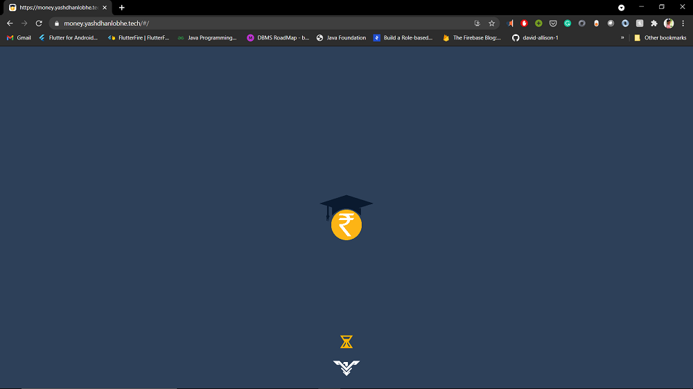
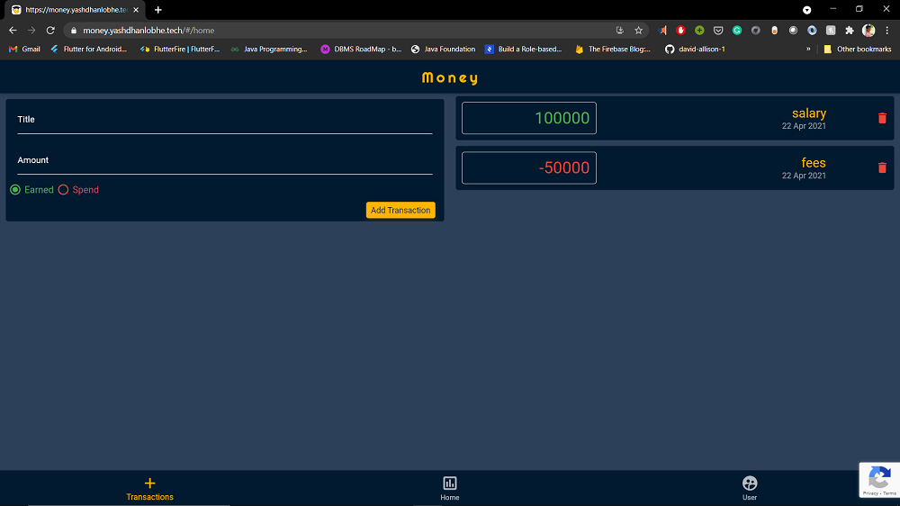
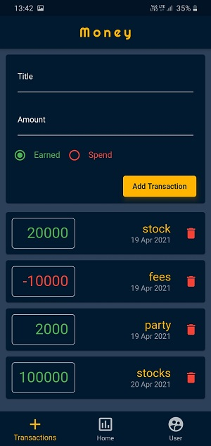
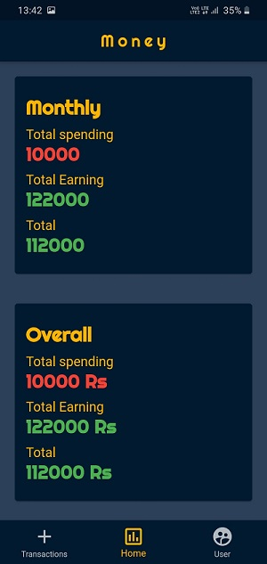
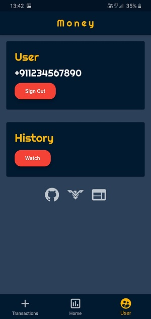

# Money Expense App
Money Expense App to store your expenses and earnings on the cloud. This app has a simple and user-friendly UI, We also have a web app for this app at https://money.yashdhanlobhe.website/
  
Webapp
-----

  

Android 
-----

</img>

### Features

  
- save your expenses on cloud
- small size app
- simple basic UI 
- open source
- website also available for PC at https://money.yashdhanlobhe.website/
- secure login system
- can login from any device with a phone number
- monthly analysis of your expenses
- expense history also available

Install
---------
The app is hosted on playstore, you can download by the link given below.

Contribute
---------
Contribute to this app so we can  make this a good open source project.
